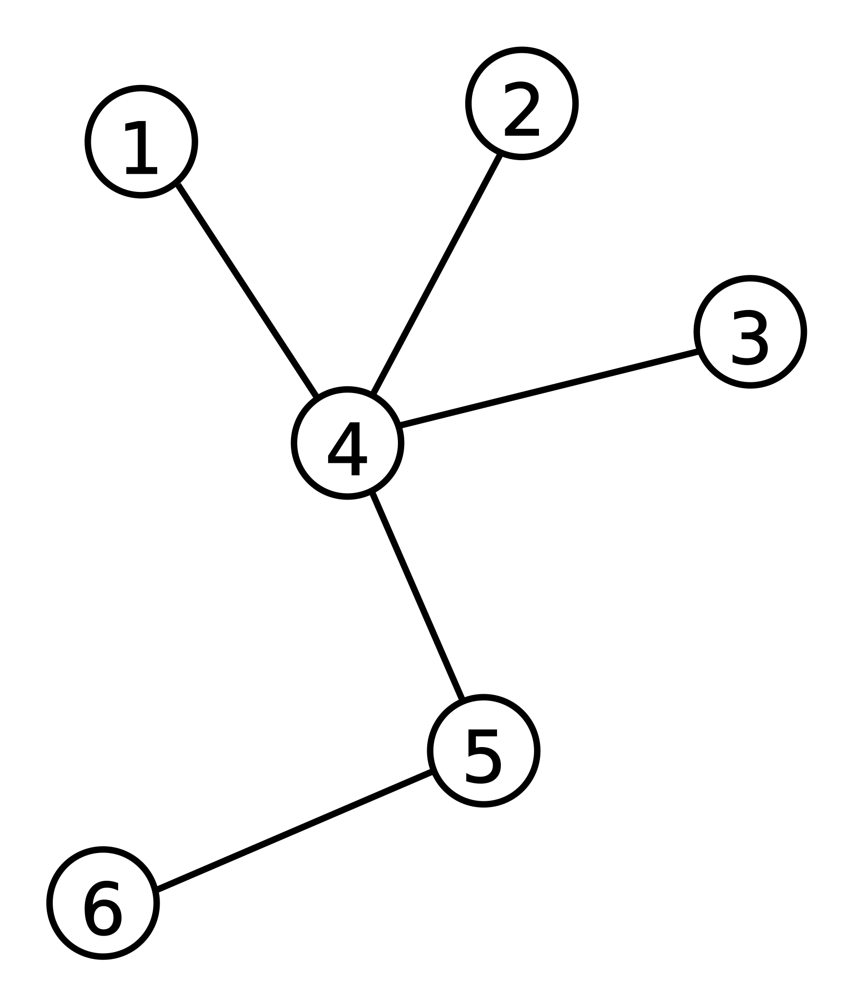

# TEORÍA DE GRAFOS
 * Rama de las matemáticas y las ciencias de la computación que estudia las propiedades de los grafos
 * Un grafo $\displaystyle G=(V,E)$ es una pareja ordenada en la que $\mathbf{V}$ es un conjunto no vacío de **vértices** y $\mathbf{E}$ es un conjunto de **aristas**.
     + $\mathbf{V}$ consta de pares no ordenados de vértices, tales como ${x,y} \in E $, entonces decimos que $x$ e  $y$ son adyacentes.

# Un poco de historia

* Siglo XVIII: Problema de los puentes de _Königsberg_: Encontrar un camino que recorriera los siete puentes del río Pregel,de modo que se recorrieran todos los puentes pasando una sola vez por cada uno de ellos. 

+ 1736: El trabajo de Leonhard Euler sobre el problema titulado "La solución de un problema relativo a la geometría de la posición" es considerado el primer resultado de la teoría de grafos.[@euler1741solutio]

```{r echo=FALSE, fig.align="center", out.height=400, out.width=360,  fig.cap= "Los siete puentes del río Pregel"}

knitr::include_graphics("Konigsberg_bridges.png")
```

# Composición y conceptos


* **_Grafo simple o grafo:_** Conjunto de _nodos_ unidos por enlaces llamados _aristas_.

* **_Grafo completo_**:  Grafo simple donde _cada par de vértices_ está conectado por una _arista_. Tiene $n(n-1)/2$ aristas. Grafo regular de grado $n-1$

* **_Camino:_** Secuencia de vértices dentro de un grafo tal que exista una arista entre cada vértice y el siguiente.


```{r echo=FALSE, fig.align="center", out.height=240, out.width=260,  fig.cap= "Grafo completo ponderado"}

knitr::include_graphics("grafo_completo.png")
```

# Tipos de grafos

* **_Subgrafo:_** Cuyo conjunto de vértices(como el de aristas) es un subconjunto del de grafo original.

* **_Grafo de arcos ponderados o etiquetado_**:  Grafo con asignaciones de pesos en cada arco.

* **_Árbol:_** Donde cualesquiera dos vértices están conectados por exactamente _un camino_.

```{r echo=FALSE, fig.align="center", out.height=240, out.width=260,  fig.cap= "Árbol"}


```

#Ejemplo básico en R
```{r echo=TRUE, message=FALSE, warning=FALSE, paged.print=FALSE}
library(igraph)
g <- graph.formula(1-2, 1-3 ,1-4, 1-5 , 1-6 ,1-7, 2-6, 2-7, 3-5, 4-5 ,4-6, 4-7, 5-6, 5-7, 6-7)
# V(g) Muestra las etiquetas vértices del grafo
# E(g) Muestra los arcos del grafo
plot(g)
```

