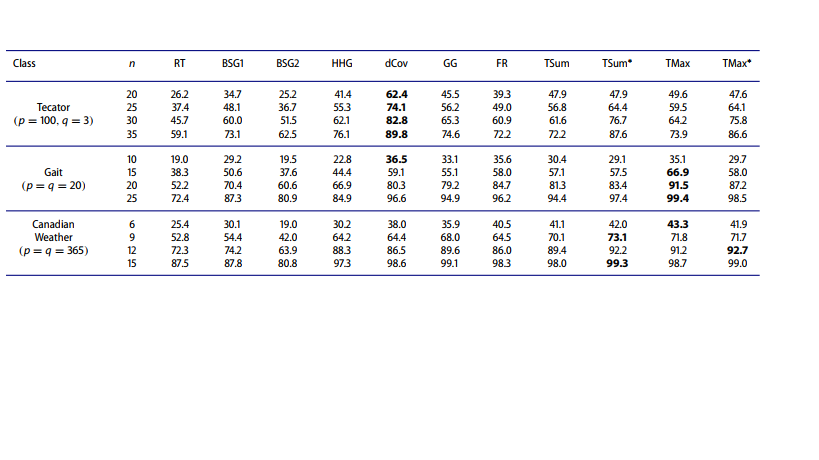

# PRECISIONES DEL TEST


Se consideran dos grafos completos de arcos ponderados $\mathcal{G}_{\mathbf{x}}$ y $\mathcal{G}_{\mathbf{y}}$ con nodos $\mathbf{x_1,...,x_n}$  y $\mathbf{y_1,..., y_n}$, respectivamente, donde $d_{i,j}^{\mathbf{x}}$ (y, correspondientemente, $d_{i,j}^{\mathbf{y}}$) es la ponderación asociada con el lado que conecta a $\mathbf{x}_i$ y $\mathbf{x}_j$ (y, paralelamente, con $\mathbf{y}_i$ y $\mathbf{y}_j$) [@friedman1983graph]

# Grafo K vecinos más próximos 
El gráfico K-NN en  $\mathcal{G}_{\mathbf{x}}$ tiene un arco entre $x_i$ y $x_j$, si $x_i$ es uno de los primeros K vecinos de $x_j$ o viceversa; y, análogamente, para $\mathcal{G}_{\mathbf{x}}$.

```{r fig.align='center', fig.cap="1-NN 50 obs. Normal bivariada", out.width=450, out.height=320, echo=FALSE}
knitr::include_graphics("1-nn.png")
```

# Ejemplo: Grafo 5-NN

```{r fig.align='center', fig.cap="5-NN en 50 obs. Normal bivariada", out.width=450, out.height=320, echo=FALSE}
knitr::include_graphics("5-nn.png")
```

#  El árbol recubridor mínimo (MST)
Es un subgrafo que tiene que ser un árbol y contener todos los vértices del grafo inicial y, a la vez, será el de la menor suma de los pesos.

```{r fig.align='center', fig.cap="1-MST en 50 obs. Normal bivariada", out.width=450, out.height=320, echo=FALSE}
knitr::include_graphics("1-MST.png")
```

# Ejemplo: Grafo 5-MST
El r-MST, $r={1, 2,...,K}$, es un árbol recubridor mínimo que no comparte arco alguno con ninguno  de los r-1 anteriores.

```{r fig.align='center', fig.cap="5-MST en 50 obs. Normal bivariada", out.width=450, out.height=320, echo=FALSE}
knitr::include_graphics("5-MST.png")
```

# Test estadístico


Sea $\tau_x^k$ y $\tau_y^k$ el K-MST o el K-NN sobre el grafo completo $\mathcal{G}_{\mathbf{x}}$ y $\mathcal{G}_{\mathbf{x}}$, respectivamente.

Se define lo siguiente para determinar el número de arcos en común.

$$a_{ij}=  \left\{
  \begin{array}{ll}
 1 &  \mathcal{Sí} \ (i,j)\in \mathcal{G}_{\mathbf{x}}  \\
 0 &  \mathcal{e.o.c.} \\ 
 \end{array}
\right.
$$
De la misma forma se definen los $b_{i,j}$  basados en las distancias de $\mathcal{Y}$.


El estadístico correspondiente es:

 $$T_{RF} = \displaystyle \sum_{i=1}^n \sum_{j=1}^n a_{ij}b_{ij}$$
 
 
 
# Test estadístico libre de distribución basado en grafos

> Pequeñas distancias en $\mathcal{x}$ corresponden a pequeñas distancias en $\mathcal{y}$

Seleccionamos un recorrido aleatorio del árbol, donde en cada paso comenzamos en un nodo ya visitado,$i \in V= {1,2,...,n}$, y avanzamos hacia un nuevo nodo,$j \in V^c$,. Por lo tanto, el árbol se recorre en $n-1$ pasos. Se calcula el rango $R_i$ en cada $d_{i,j}^{\mathbf{y}}$ y se obtienen $n-2$ rangos.

Y se usa el siguiente estadístico

$$T_{RT} =  -2 \displaystyle \sum_{i=1}^{n-2} log(\dfrac{R_j}{n-i})$$

# Ejemplo de juguete
```{r fig.align='center', fig.cap="Ejemplo de juguete", out.width= 500, out.height=450, echo=FALSE}
knitr::include_graphics("test6.png")
```


# Algoritmo de Prim
Permite encontrar un árbol recubridor mínimo de un grafo no dirigido y completo.
1. Se selecciona el arco con menor peso.
2. Aumentar el árbol por un lado: De las posibles uniones que pueden conectar el árbol a los vértices que no están aún en el árbol, encontrar el lado de menor distancia y unirlo al árbol.
3. Repetir el paso 2 (hasta que todos los vértices pertenezcan al árbol) [@heller2012consistent]

# Ejemplo

```{r fig.align='center', fig.cap="Ejemplo de juguete", out.width= 400, out.height=320, echo=FALSE}
knitr::include_graphics("Minimum_spanning_tree.svg")
```

# Test modificado libre de distribución


A causa de la selección aleatoria del recorrido, el anterior test puede determinar inferencias engañosas. Para eso se usa un recorrido sistemático siguiendo el _algoritmo de Prim_. [@heller2012consistent]

Y se usa el estadístico $T_{RT}$ de la misma notación; en vez de $R_i$, se usa $R_o$ para distiguir la selección sitematizada de la aleatoria.

$$T^{o} = -2 \displaystyle \sum_{i=1}^{n-2} log \left( \dfrac{R_i^o}{n-i}\right)$$

Sin embargo, los anteriores test se desempeñan deficientemente en caso de estar $d_{i,j}^{\mathbf{y}}$ y $d_{i,j}^{\mathbf{y}}$ negativamente relacionada. El problema es afrontado haciendo

$$R_i^{r} = n-i+1- R_o^i$$ para $i= 1, 2, ... , n-2$ 

Así

$$ T^{r} = -2 \displaystyle \sum_{i=1}^{n-2} log \left( \dfrac{R_i ^r}{n-i}\right)$$


# EJEMPLO CON DATOS REALES


  ```{r fig.align='center', fig.cap="Tabla de contingencia para la clasificación cruzada", out.width=800, out.height=450, echo=FALSE}

```


# CONCLUSIONES
 
 
* Si bien los test estadísticos presentados al principio se usan para probar la independencia, en el caso en el que el número de variables supera el de individuos presentan limitaciones o no aplicabilidad; lo cual motivó el desarrollo y presentación de métodos basados en grafos, los cuales buscan proveer una mejor herramienta para probar independencia entre  las variables en situaciones de HDLSSD.

* En la construcción del test, se requiere algún tipo de asociación entre las x-distancias y las y-distancias, entonces estas relaciones se  pueden reflejar en sus vecinos más cercanos y el enfoque es llevado a buscar proximidades y coincidencias.

* Aunque, para la implementación de los distintos test se utilizó la distancia Euclidiana, es posible emplear otro concepto de distancia.

 